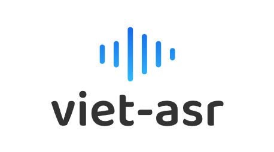

<p align="center">
  
  <h1 align="center"style="color: white; font-weight: bold; font-family:roboto"><span style="color: white; font-weight: bold; font-family:roboto">VietASR</span>: An Open-Source Vietnamese Speech to Text</h1>
</p>
<p align="center">
  <a href="https://github.com/dangvansam/viet-asr"></a>
    <a href="https://github.com/dangvansam/viet-tts"></a>
    <!-- <a href="https://pypi.org/project/viet-tts" target="_blank"> -->
    <a href="LICENSE"></a>
    </a>
    <br>
    <a href="README.md"></a>
    <a href="README_VN.md"></a>
  <a href="https://github.com/dangvansam/viet-tts"></a>
    <br>
</p>

🚀 Some experiment with [NeMo](https://github.com/NVIDIA/NeMo),
ASR use [QuartzNet](https://docs.nvidia.com/deeplearning/nemo/user-guide/docs/en/main/asr/models.html#quartznet) model is a smaller version of [Jaser](https://docs.nvidia.com/deeplearning/nemo/user-guide/docs/en/main/asr/models.html#jasper) model.

The pretrained model on this repo was trained with ~100 hours Vietnamese speech dataset, was collected from youtube, radio, call center(8k), text to speech data and some public dataset (vlsp, vivos, fpt). It is very small model (13M parameters) make it inference so fast ⚡  

🌱 _Update: The new version available on [`branch v2.0`](https://github.com/dangvansam/viet-asr/tree/v2.0) is built from scratch with PyTorch_

🌱 _For Text to Speech, visit [`VietTTS`](https://github.com/dangvansam/viet-tts) repo_

Installation
------------
+ Update & install linux libs:
```bash
apt-get update && apt-get install -y libsndfile1 ffmpeg
```
+ Install [python>=3.8](https://www.python.org/downloads/release/python-385/)
* Python libs:
```bash
pip install -r requirements.txt
```
+ Install [torch 1.8.1](https://pytorch.org/get-started/previous-versions/#v181):
```bash
# cpu only, you can install CUDA version if you have NVidia GPU
pip install torch==1.8.1+cpu torchvision==0.9.1+cpu torchaudio==0.8.1 -f https://download.pytorch.org/whl/torch_stable.html
```
+ Install [kemlm](https://github.com/kpu/kenlm) for LM decoding (only support Linux) 
```bash
pip install https://github.com/kpu/kenlm/archive/master.zip
```
Transcribe audio file
--------
```bash
python infer.py audio_samples # will transcribe audio file in folder: audio_samples
```
Run web application
--------
* Run app:
```bash
python app.py # app will run on address: https://localhost:5000
```
[]()  

* Video demo on Youtube:
   + v1: https://youtu.be/P3mhEngL1us  
   + v2: https://youtu.be/o9NpWi3VUHs  

[](https://youtu.be/P3mhEngL1us)  

<!-- * English Model ([pretrained](model_english)) -->

TODO
------
* Conformer Model
* Data augumentation: speed, noise, pitch shift, time shift,...  
* FastAPI
* Add Dockerfile

Citation
--------
```
  @article{kuchaiev2019nemo,
    title={Nemo: a toolkit for building ai applications using neural modules},
    author={Kuchaiev, Oleksii and Li, Jason and Nguyen, Huyen and Hrinchuk, Oleksii and Leary, Ryan and Ginsburg, Boris and Kriman, Samuel and Beliaev, Stanislav and Lavrukhin, Vitaly and Cook, Jack and others},
    journal={arXiv preprint arXiv:1909.09577},
    year={2019}
  }
```
