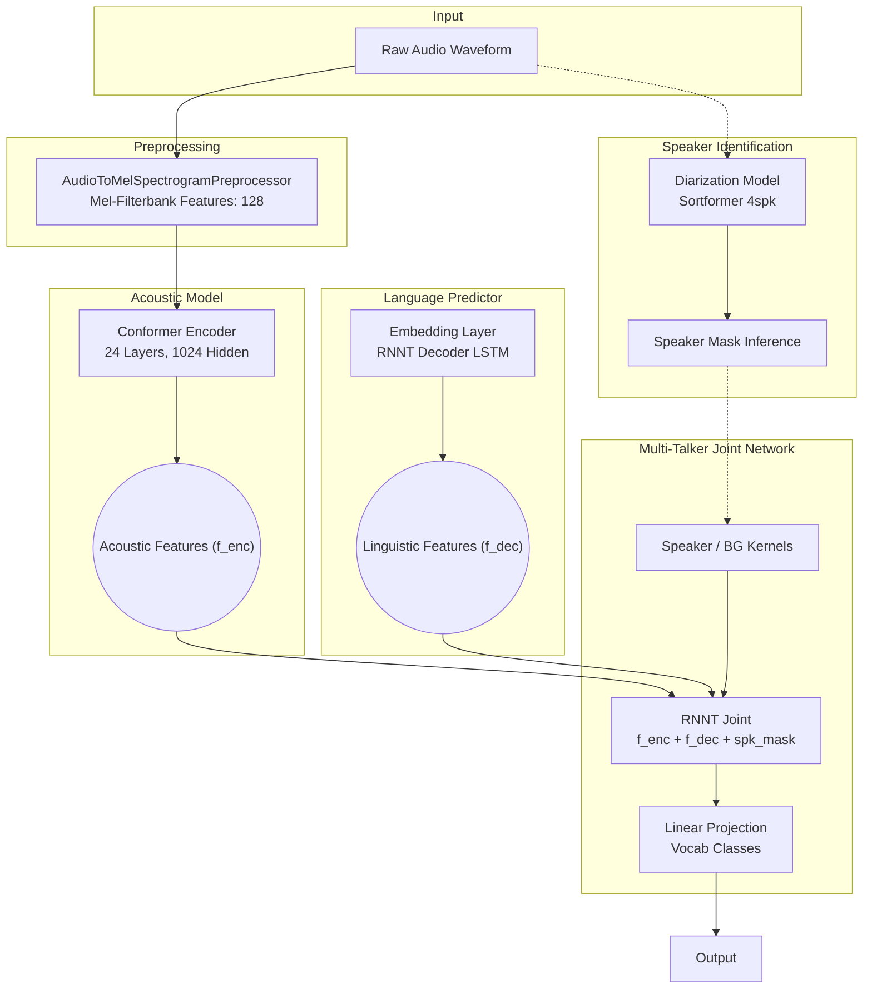

# Vietnamese Multitalker ASR

A complete pipeline for training, fine-tuning, and deploying a Vietnamese multi-speaker ASR system based on NVIDIA's `multitalker-parakeet-streaming-0.6b-v1` using the NeMo toolkit.

## Features
- **On-the-fly Synthesis**: Generate overlapping multi-speaker training data dynamically during the training loop. No need to pre-generate massive mixed audio files.
- **Checkpoint Resumption**: Seamlessly resume training from PyTorch Lightning `.ckpt` files with preserved optimizer state and vocabulary.
- **Data Preparation**: Efficiently convert single-speaker TTS datasets into NeMo-compliant `json` manifests.
- **Modular Core**: Reusable `MultitalkerASRModel` class in `src/multitalker_asr/` for inference and fine-tuning.
- **CLI Scripts**: Clean wrappers for training, inference, and data management.

---

## 1. Installation

### Prerequisites
- Python 3.10+
- `ffmpeg` installed on the system (`sudo apt install ffmpeg`).

### Install Dependencies
1. Clone or navigate to the project root.
2. Use `uv` to install the requirements from `pyproject.toml`.

```bash
uv sync
```

### Download Base Models (Required)
Download the required NeMo checkpoints to the `models/` directory:

```bash
mkdir -p models
# Parakeet 0.6B ASR Base Model
wget -c https://huggingface.co/nvidia/multitalker-parakeet-streaming-0.6b-v1/resolve/main/multitalker-parakeet-streaming-0.6b-v1.nemo -P models/

# Sortformer v2.1 Diarization Model
wget -c https://huggingface.co/nvidia/diar_streaming_sortformer_4spk-v2.1/resolve/main/diar_streaming_sortformer_4spk-v2.1.nemo -P models/
```

---

## 2. Data Preparation

Our pipeline uses **on-the-fly synthesis**, meaning you only need to prepare your **single-speaker** datasets.

### Step A: Prepare Source Data
Format your single-speaker datasets into a standard CSV or use the helper script to scan a TTS directory:

```bash
uv run scripts/prepare_all_tts_data.py \
    --data_root /path/to/tts_datasets \
    --output_dir data \
    --val_split 0.05
```
This generates `data/train_single_speaker.json` and `data/val_single_speaker.json`.

---

## 3. Training & Fine-tuning

### Option 1: Start Training from Scratch (or Base Model)
Use the `run_full_training.sh` script to handle the entire pipeline (data split, tokenizer training, and finetuning):

```bash
./scripts/run_full_training.sh
```

### Option 2: Individual Training Command
You can run the fine-tuning script directly with on-the-fly synthesis enabled:

```bash
uv run scripts/finetune.py \
    --model_path models/multitalker-parakeet-streaming-0.6b-v1.nemo \
    --train_manifest data/train_single_speaker.json \
    --val_manifest data/val_single_speaker.json \
    --use_on_the_fly_synthesis \
    --max_speakers 4 \
    --batch_size 64 \
    --accumulate_grad_batches 4 \
    --gpus 1
```

### Option 3: Resuming from a Checkpoint
If training was interrupted or you want to continue from a specific PyTorch Lightning `.ckpt` file:

```bash
./scripts/resume_training.sh checkpoints/epoch=4-step=19590.ckpt
```
*The resume script automatically preserves the tokenizer and optimizer state.*

---

## 4. Inference

Run inference on an audio file (single or mixed speaker):

```bash
uv run scripts/infer.py \
    --model_path "checkpoints/best_model.nemo" \
    --audio "test.wav" \
    --output "result.json"
```

The output will be in NeMo's SegLST JSON format:
```json
[
  {
    "audio_filepath": "test.wav",
    "offset": 0.5,
    "duration": 2.1,
    "label": "speaker_0",
    "text": "xin chào các bạn"
  }
]
```

---

## 5. Architecture Details


```mermaid
graph TD
    subgraph Input
        A[Raw Audio Waveform]
    end

    subgraph Preprocessing
        B[AudioToMelSpectrogramPreprocessor<br>Mel-Filterbank Features: 128]
    end

    subgraph Speaker Identification
        S1[Diarization Model<br>Sortformer 4spk]
        S2[Speaker Mask Inference]
    end

    subgraph Acoustic Model
        C[Conformer Encoder<br>24 Layers, 1024 Hidden]
        F_ENC(("Acoustic Features (f_enc)"))
    end

    subgraph Language Predictor
        E[Embedding Layer<br>RNNT Decoder LSTM]
        F_DEC(("Linguistic Features (f_dec)"))
    end

    subgraph Multi-Talker Joint Network
        S3[Speaker / BG Kernels]
        F[RNNT Joint<br>f_enc + f_dec + spk_mask]
        G[Linear Projection<br>Vocab Classes]
    end

    A --> B
    A -.-> S1
    S1 --> S2
    B --> C
    C --> F_ENC
    E --> F_DEC
    S2 -.-> S3
    F_ENC --> F
    F_DEC --> F
    S3 --> F
    F --> G --> Output
```

### Logic & Mechanism Overview
The `EncDecMultiTalkerRNNTBPEModel` combines acoustic Conformer features with linguistic LSTM state and **Speaker Masks** from a diarization model. 

1. **Encoder**: Processes specrogram into acoustic features.
2. **Diarization**: Predicts which speakers are active at each timeframe.
3. **Joint Network**: Combines acoustic, linguistic, and speaker information to emit the correct tokens for the active speaker.

Our implementation optimizes this by synthesizing these complex multi-speaker overlaps **on-the-fly** during training, allowing for effectively infinite data variety.
