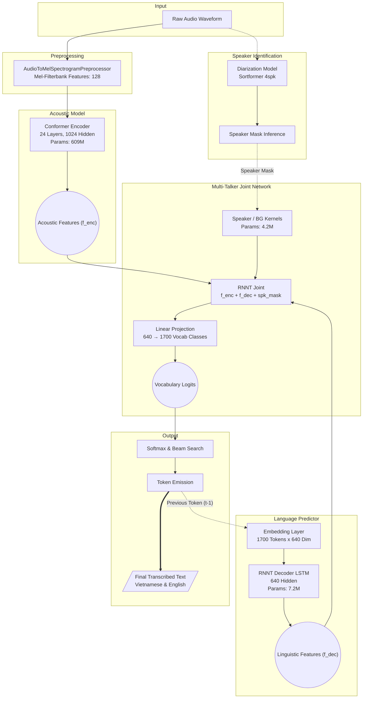

# Vietnamese Multitalker ASR

A complete pipeline for training, fine-tuning, and deploying a Vietnamese multi-speaker ASR system based on NVIDIA's `multitalker-parakeet-streaming-0.6b-v1` using the NeMo toolkit.

## Features
- **Data Preparation**: Convert standard transcript CSVs to NeMo-compliant `json` manifests via `scripts/prepare_data.py`.
- **Synthetic Multi-Speaker Overlap Data**: Mix single-speaker TTS voice datasets into realistic overlapping conversational datasets via `scripts/synthesize_data.py`.
- **Modular Core**: Reusable `MultitalkerASRModel` class in `src/multitalker_asr/` for integration into APIs or other scripts.
- **CLI Scripts**: Clean wrappers in the `scripts/` directory for all major operations.

---

## 1. Installation

### Prerequisites
- Python 3.10+
- `ffmpeg` installed on the system (`sudo apt install ffmpeg`).

### Install Dependencies
1. Clone or navigate to the project root.
2. Use `uv` to install the requirements from `pyproject.toml`, which includes PyTorch Lightning, Librosa, and the NeMo toolkit directly from GitHub.

```bash
uv sync
```

### Download Base Models (Recommended)
Hugging Face wrappers can sometimes hang when downloading the massive NeMo checkpoints directly in code. It's recommended to download them to a `models/` folder beforehand.

```bash
mkdir -p models
# Download Parakeet 0.6B ASR Base Model (2.3GB)
wget -c https://huggingface.co/nvidia/multitalker-parakeet-streaming-0.6b-v1/resolve/main/multitalker-parakeet-streaming-0.6b-v1.nemo -P models/

# Download Sortformer v2.1 Diarization Base Model (450MB)
wget -c https://huggingface.co/nvidia/diar_streaming_sortformer_4spk-v2.1/resolve/main/diar_streaming_sortformer_4spk-v2.1.nemo -P models/
```

---

## 2. Data Preparation Pipeline

Multitalker ASR requires overlapping multi-speaker audio with `SegLST` JSON manifests to train effectively. We provide a two-step script process to generate this from your single-speaker TTS datasets.

### Step A: Format your single-speaker datasets
First, format your source datasets into a standard CSV `dataset.csv`:
```csv
filename,speaker_id,start_time,duration,text
audio_01.wav,nam-mien-bac,0.0,3.5,xin chào bạn
...
```

Run the preparation script to generate a single-speaker NeMo manifest:
```bash
uv run scripts/prepare_data.py \
    --csv dataset.csv \
    --audio_dir /path/to/your/audio_files/ \
    --output data/single_speaker.json
```

### Step B: Synthesize Overlapping Multi-Speaker Data
Mix the single-speaker audio into overlapping, multi-speaker conversational files:
```bash
uv run scripts/synthesize_data.py \
    --input_manifests data/single_speaker.json \
    --output_dir ./data/synthesized_train_audio/ \
    --output_manifest data/train_mixed.json \
    --num_samples 1000 \
    --max_speakers 3
```
*Note: Run this again with different inputs or random seeds to generate `data/val_mixed.json` for validation.*

---

## 3. Fine-tuning the Model

To adapt the base `Parakeet-0.6B` model to Vietnamese, run the fine-tuning script:

```bash
uv run scripts/finetune.py \
    --model_path models/multitalker-parakeet-streaming-0.6b-v1.nemo \
    --train_manifest data/train_mixed.json \
    --val_manifest data/val_mixed.json \
    --gpus 1 \
    --max_steps 10000
```
*(Note: PyTorch Lightning logs and checkpoints will be saved to the `checkpoints/` directory.)*

*(Note: If you run into `LightningModule` class validation errors during fine-tuning initialization, ensure your PyTorch Lightning version matches the exact compatibility requirements of the NeMo commit. Often `pytorch-lightning<2.0` is required).*

The script will save the newly tuned checkpoint to `models/multitalker-parakeet-streaming-0.6b-v1-finetuned.nemo`.

---

## 4. Inference

Run out-of-core inference on an audio file:

```bash
# Example running on CPU for testing
uv run scripts/infer.py \
    --model_path "models/multitalker-parakeet-streaming-0.6b-v1.nemo" \
    --audio "demo_audio.wav" \
    --output "data/transcript.json" \
    --cpu
```

*Replace `cuda=-1` and `device="cpu"` with `cuda=0` and `device="cuda"` if you are running on a machine with a 24GB+ GPU.*

### The Output format (`transcript.json`)
The output will be in NeMo's SegLST JSON format outlining exactly when each speaker spoke:
```json
[
  {
    "audio_filepath": "demo_audio.wav",
    "offset": 1.5,
    "duration": 2.1,
    "label": "speaker_0",
    "text": "xin chào các bạn"
  },
  {
    "audio_filepath": "demo_audio.wav",
    "offset": 2.8,
    "duration": 1.9,
    "label": "speaker_1",
    "text": "chào buổi sáng"
  }
]
```

---

## 5. Architecture Details


```mermaid
graph TD
    subgraph Input
        A[Raw Audio Waveform]
    end

    subgraph Preprocessing
        B[AudioToMelSpectrogramPreprocessor<br>Mel-Filterbank Features: 128]
    end

    subgraph Speaker Identification
        S1[Diarization Model<br>Sortformer 4spk]
        S2[Speaker Mask Inference]
    end

    subgraph Acoustic Model
        C[Conformer Encoder<br>24 Layers, 1024 Hidden<br>Params: 609M]
        F_ENC(("Acoustic Features (f_enc)"))
    end

    subgraph Language Predictor
        E[Embedding Layer<br>1700 Tokens x 640 Dim]
        D[RNNT Decoder LSTM<br>640 Hidden<br>Params: 7.2M]
        F_DEC(("Linguistic Features (f_dec)"))
    end

    subgraph Multi-Talker Joint Network
        S3[Speaker / BG Kernels<br>Params: 4.2M]
        F[RNNT Joint<br>f_enc + f_dec + spk_mask]
        G[Linear Projection<br>640 → 1700 Vocab Classes]
        H(("Vocabulary Logits"))
    end

    subgraph Output
        I[Softmax & Beam Search]
        J[Token Emission]
        K[/"Final Transcribed Text<br>Vietnamese & English"/]
    end

    A --> B
    A -.-> S1
    S1 --> S2
    
    B --> C
    C --> F_ENC
    
    J -. "Previous Token (t-1)" .-> E
    E --> D
    D --> F_DEC

    S2 -. "Speaker Mask" .-> S3
    
    F_ENC --> F
    F_DEC --> F
    S3 --> F
    
    F --> G
    G --> H
    H --> I
    I --> J
    J ===> K
```

### Original Model (English)
- **Tokenizer:** 1024 BPE tokens (English)
- **Embedding:** (1025, 640) - 1024 tokens + 1 blank
- **Encoder:** ConformerEncoder (24 layers, 1024 hidden)
- **Decoder:** RNNTDecoder (LSTM, 640 hidden)
- **Joint:** Linear(640 → 1025)

### Extended Model (Vietnamese + English)
- **Tokenizer:** ~1700 BPE tokens (1024 English + ~675 Vietnamese)
- **Embedding:** (1700, 640) - preserved English + completely guarded initial limits for Vietnamese tokens to eliminate RNN-T target looping
- **Encoder:** Unchanged (language-agnostic, preserved entirely)
- **Decoder:** Same architecture, larger embedding
- **Joint:** Linear(640 → 1700)

### Vietnamese-Only Model
- **Tokenizer:** ~2048 BPE tokens (Vietnamese)
- **Embedding:** (2049, 640) - random initialization
- **Encoder:** Preserved from pretrained (acoustic features)
- **Decoder:** Randomized embeddings
- **Joint:** Linear(640 → 2049) - randomized

### Architecture Logic & Mechanism Overview

NVIDIA's `EncDecMultiTalkerRNNTBPEModel` fundamentally splits the multi-speaker ASR process into distinct, decoupled modular systems, enabling immense customization flexibility for developers:

1. **Acoustic Processing (Encoder)**
   - The raw `16kHz` audio is passed into an `AudioToMelSpectrogramPreprocessor`, yielding 128-dimensional filterbanks.
   - The **Conformer Encoder** (609M params) processes the spectral features into high-level acoustic embeddings (`f_enc`). Since the encoder is purely acoustic, it operates entirely independently of vocabulary, meaning transferring this from English to Vietnamese perfectly retains its powerful structural acoustic representations.

2. **Diarization & Speaker Masking**
   - In parallel, the audio is analyzed by a standalone Diarization Model (e.g., `Sortformer 4spk` or a custom `ECAPA-TDNN` pipeline).
   - This auxiliary model outputs a localized **Speaker Mask** (a binary 0/1 map detailing exactly when Speaker 1, 2, 3, etc. are active).
   - These masks are mathematically projected through the internal ASR **Speaker Kernels** (`spk_kernels` & `bg_spk_kernels`), acting as trainable "glue" layers to cleanly fuse speaker identity directly into the downstream joint network.

3. **Linguistic Processing (Decoder)**
   - The **RNN-T Decoder** functions as an auto-regressive language model. It takes the transcription generated so far (e.g., Token `t-1`), embeds it via the `Embedding Layer`, and computes linguistic expectation vectors (`f_dec`).

4. **Multi-Talker Joint Projection**
   - The `RNNT Joint` is the heart of the network. It combines the `f_enc` (what does it sound like?), `f_dec` (what word logically comes next?), and the `spk_kernels` (who is speaking right now?). 
   - A final `Linear Projection` maps this combined state space to explicit vocabulary class logits (the tokens).
   - A **Greedy Beam Search** determines the maximum logit. Crucially, the model relies natively on a `blank` pseudo-token (mathematically bound to `0.0`) to "wait" and loop through timeframes without emitting random garbage characters when no new acoustic letters are pronounced!
