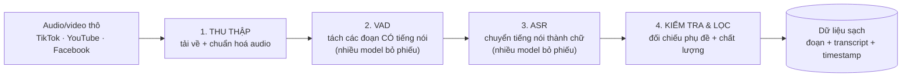
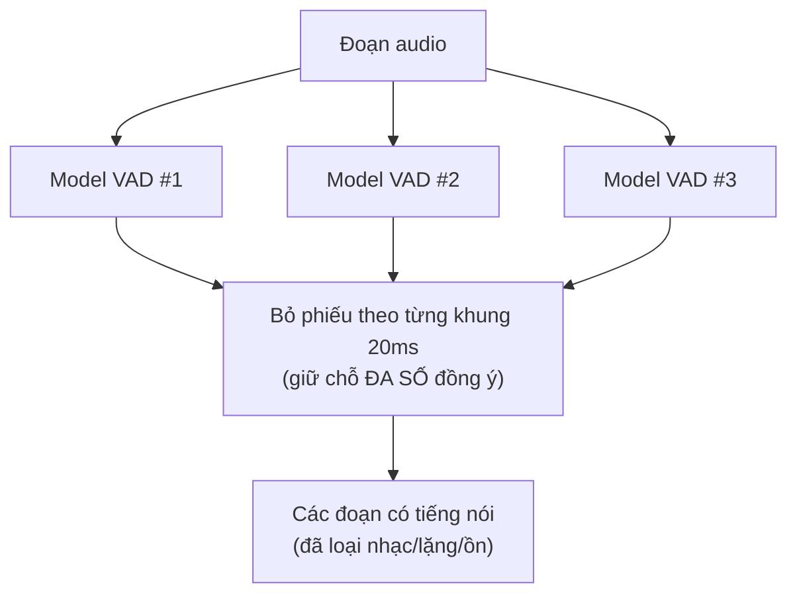
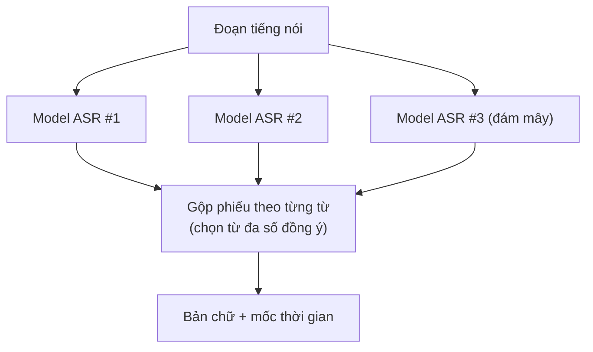
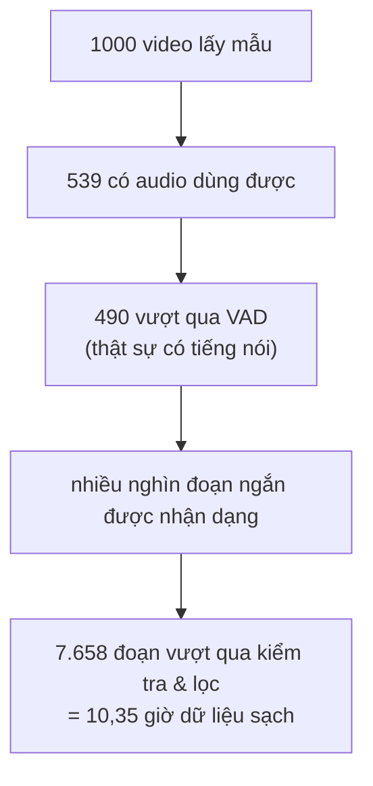

# Quy trình làm dữ liệu ASR

## 1. Bài toán & cam kết chất lượng

Chúng ta có hàng nghìn giờ audio/video thô từ TikTok, YouTube, Facebook… Nhưng audio thô **không dùng trực tiếp để training được**: lẫn nhạc nền, quảng cáo, đoạn im lặng, nhiều người nói, và không có sẵn bản chữ chính xác.

Mục tiêu của quy trình: cắt audio thô thành các **đoạn ngắn (1–30 giây), sạch tiếng**, mỗi đoạn kèm **bản chữ (transcript) + mốc thời gian (timestamp)** — đúng định dạng để máy học.

**Cam kết then chốt:** mỗi đoạn dữ liệu được **nhiều AI độc lập kiểm chứng chéo** trước khi được giữ lại. Một mô hình lẻ có thể nhầm; nhưng để nhiều mô hình cùng nhầm theo một kiểu thì rất khó — đó là cách chúng ta đảm bảo chất lượng ở quy mô lớn mà không cần soát thủ công từng đoạn.

---

## 2. Bản đồ nhanh (đọc cái này trước)



| | Mô tả |
|---|---|
| **Đầu vào** | Audio/video thô + phụ đề gốc + thông tin nguồn (TikTok / YouTube / Facebook) |
| **Đầu ra** | Các đoạn 1–30 giây, mỗi đoạn có: file audio, độ dài, bản chữ, mốc thời gian từng từ |

Cả quy trình là một **dây chuyền 4 bước**. Mỗi bước là một mắt xích **cắm-rút được** — có thể thay/đổi công cụ qua cấu hình mà không phá phần còn lại.

---

## 3. Nguồn dữ liệu (vì sao đủ lớn để đáng làm)

Dữ liệu đến từ hệ thống crawl riêng, thu thập tự động và lưu trữ có tổ chức (audio + phụ đề + thông tin chủ đề).

**Tổng quan (2026-06-11):** **347.734** video thu thập · **185.847 đã hoàn tất** · tương đương **~5.807 giờ** audio.

| Nền tảng | Đã hoàn tất | Có audio | Có phụ đề |
|---|---:|---:|---:|
| **TikTok** | 160.235 | 121.121 | 109.589 |
| **YouTube** | 22.559 | 18.681 | 7.197 |
| Facebook | 1.201 | 73 | 0 |

Quan trọng: phần lớn video **đã có sẵn phụ đề gốc**. Phụ đề này sau đó được dùng làm **"đáp án tham chiếu"** để kiểm tra chéo kết quả nhận dạng của AI (xem Bước 4) — một nguồn đối chứng miễn phí giúp tăng độ tin.

---

## 4. Bước 1 — Thu thập & chuẩn hoá audio

Hệ thống lấy mẫu cân đối giữa các nền tảng và chủ đề (không tải bừa), tải audio + phụ đề về, rồi **đưa tất cả về một định dạng chuẩn: WAV 16kHz, một kênh (mono)** — định dạng mà mọi mô hình ASR đều đọc được. Đây là bước "dọn bàn" để các bước sau làm việc trên dữ liệu đồng nhất.

---

## 5. Bước 2 — VAD: tìm đúng chỗ có tiếng nói (nhiều model bỏ phiếu)

**Vấn đề:** một clip thô thường lẫn nhạc nền, tiếng ồn, khoảng lặng, hiệu ứng… Nếu cắt nhầm những chỗ này vào dữ liệu, AI sẽ học sai. Ta cần xác định **chính xác đoạn nào thật sự có người đang nói** (gọi là VAD — Voice Activity Detection).

**Cách làm để đáng tin:** thay vì tin vào một mô hình duy nhất, chúng ta chạy **3 mô hình VAD độc lập song song**. Trục thời gian được chia thành các **khung nhỏ 20 mili-giây**; với mỗi khung, từng mô hình "bỏ phiếu" có/không có tiếng nói. Một khung **chỉ được coi là có tiếng nói khi đa số mô hình đồng ý**.



> **Ví von cho dễ hình dung:** giống như có 3 giám khảo nghe độc lập và chấm "chỗ này có người nói không"; ta lấy kết quả theo đa số. Nếu một giám khảo lỡ nhầm (ví dụ tưởng tiếng nhạc là tiếng nói), hai người còn lại vẫn giữ kết quả đúng. Nhờ vậy, **lỗi của một mô hình không kéo cả hệ thống sai theo**.

Kết quả của bước này: clip dài được cắt thành **các đoạn ngắn, chỉ chứa tiếng nói**, sẵn sàng đưa sang nhận dạng.

---

## 6. Bước 3 — ASR: chuyển tiếng nói thành chữ (nhiều model bỏ phiếu)

Mỗi đoạn tiếng nói cần được **chuyển thành văn bản** kèm **mốc thời gian từng từ**. Đây là khâu ASR (Automatic Speech Recognition).

**Cách làm để đáng tin:** mỗi đoạn được **nhiều mô hình nhận dạng độc lập** cùng phiên âm (gồm cả mô hình chạy nội bộ và dịch vụ đám mây). Sau đó hệ thống **gộp phiếu theo từng từ**: ở mỗi vị trí, từ nào được **đa số mô hình nhất trí** thì được chọn.



Cơ chế này quan trọng vì mỗi mô hình ASR có điểm mạnh/yếu khác nhau (model A nghe rõ giọng miền Bắc, model B tốt với từ vay mượn tiếng Anh…). Lấy theo đa số giúp **trung hoà lỗi riêng của từng mô hình**, cho ra bản chữ chính xác hơn bất kỳ mô hình đơn lẻ nào.

Cuối bước, văn bản được **chuẩn hoá cho "đẹp"**: thêm dấu câu và viết lại con số/ngày tháng đúng quy ước (ví dụ "hai nghìn không trăm hai sáu" → "2026"), để transcript trông như văn bản thật.

---

## 7. Bước 4 — Kiểm tra chéo & lọc (cổng chất lượng cuối)

Đây là **cổng kiểm soát** cuối cùng: một đoạn chỉ được **giữ lại** khi vượt qua đồng thời các điều kiện:

- **Khớp với phụ đề gốc** của video (so sánh bản chữ AI nhận dạng với phụ đề có sẵn — nếu lệch quá nhiều, nghi ngờ và loại).
- **Mốc thời gian phủ đủ** đoạn audio (không bị thiếu/lệch đầu-cuối).
- **Độ tin của mô hình đủ cao**.

Đoạn nào không đạt sẽ bị **loại bỏ** thay vì cố giữ — chúng ta ưu tiên **dữ liệu sạch hơn là dữ liệu nhiều**.

**Phễu số liệu thật** (minh hoạ từ một mẻ mẫu 1.000 video):



Tỉ lệ loại bỏ ở mỗi cổng chính là **bằng chứng quy trình đang làm việc**: nó chủ động vứt đi phần rủi ro thay vì để lọt vào tập huấn luyện.

---

## 8. Kết quả & cam kết đầu ra

Từ mẻ mẫu 1.000 video ở trên:

| Chỉ số | Giá trị |
|---|---|
| Video có audio dùng được | 539 |
| **Tổng số đoạn sạch / số giờ** | **7.658 đoạn / 10,35 giờ** |
| Độ dài mỗi đoạn | trung bình 4,9s · trung vị 3,0s |
| Mức khớp với phụ đề gốc | trung bình 0,74 (trên thang 0–1) |

Mỗi đoạn trong dữ liệu đầu ra trông như sau (đã rút gọn cho dễ đọc):

```json
{
  "audio_filepath": ".../segments/audio_3.20_7.10.wav",
  "duration": 3.9,
  "text": "Xin chào quý vị và các bạn.",
  "timestamps": [
    {"word": "Xin",  "start": 3.20, "end": 3.45},
    {"word": "chào", "start": 3.45, "end": 3.78}
  ]
}
```

Tức là: một **file audio ngắn + bản chữ đã chuẩn hoá + mốc thời gian từng từ** — đúng thứ cần để huấn luyện và đánh giá mô hình ASR.

---

## 9. Phụ lục kỹ thuật (cho ai muốn đào sâu)

Phần này dành cho đội kỹ thuật; sếp có thể bỏ qua.

**Các mô hình VAD dùng trong "bỏ phiếu" (Bước 2):**

| Tên | Ghi chú |
|---|---|
| `silero` | Nhẹ, nhanh, mặc định |
| `pyannote_seg` | `pyannote/segmentation-3.0` (cần HF token) |
| `ten` | TEN-VAD |

Cơ chế: mỗi mô hình tạo ra các vùng speech → raster hoá lên lưới khung **20ms** → vote theo khung với chiến lược `majority` (đa số, `>= ceil(N/2)`); còn có `intersection` (tất cả phải đồng ý) và `union` (chỉ cần một). Mô hình thiếu thư viện sẽ bị bỏ qua kèm cảnh báo, hệ thống chạy tiếp trên các mô hình còn lại. Mã nguồn: [src/multitalker_asr/data/pipeline/vad_backends/consensus.py](src/multitalker_asr/data/pipeline/vad_backends/consensus.py).

**Các mô hình ASR dùng trong "bỏ phiếu" (Bước 3):**

| Tên | Loại | Ghi chú |
|---|---|---|
| `funasr_mlt` | Nội bộ | Fun-ASR-MLT: dấu câu tốt, có mốc thời gian từng từ |
| `qwen3_vllm` | Nội bộ (HTTP) | Qwen3-ASR qua vLLM |
| `google_speech` | Đám mây | Google Speech-to-Text V2 (chirp_3, vi-VN) |
| `vietasr` | Trên thiết bị | Nhỏ gọn, chạy offline (thường không dấu câu) |

Cơ chế gộp phiếu: chiến lược `vote` (gom theo độ tương đồng văn bản, lấy cụm lớn nhất) hoặc gộp phiếu theo **từng từ** dựa trên mốc thời gian — phụ đề gốc được tính phiếu với trọng số 1,5×.
