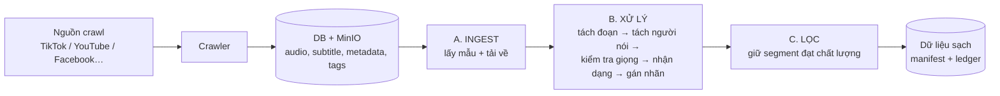
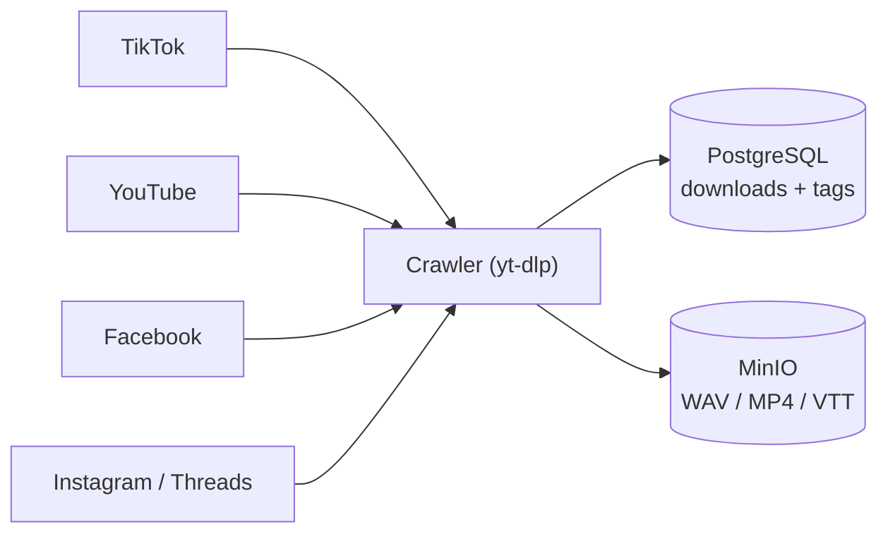
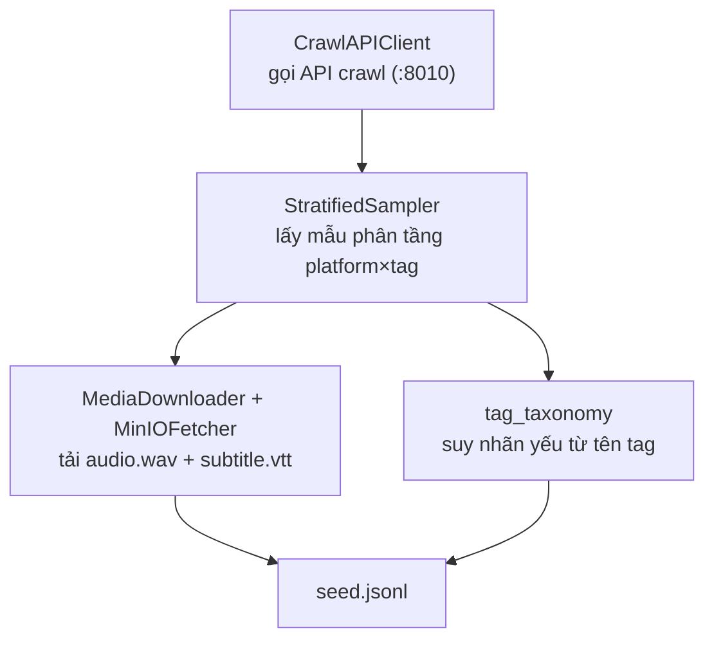
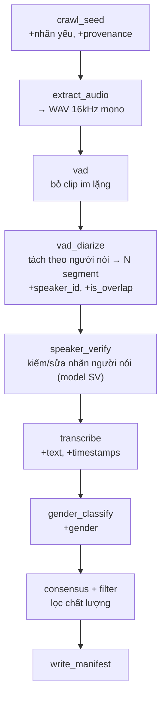
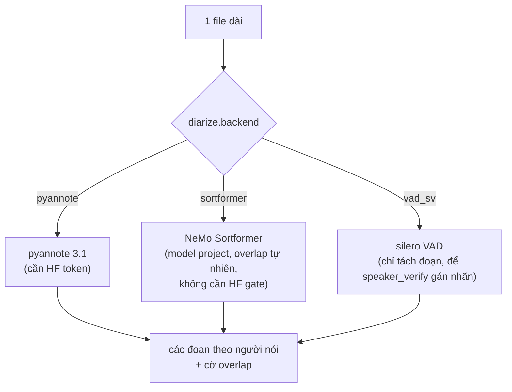
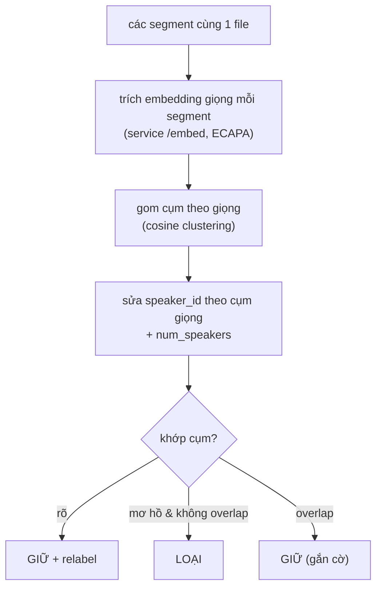
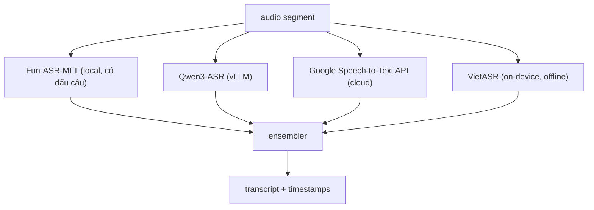
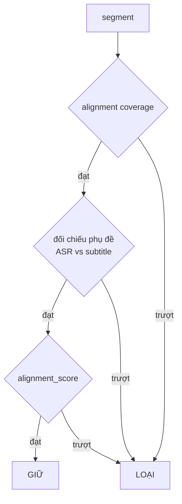
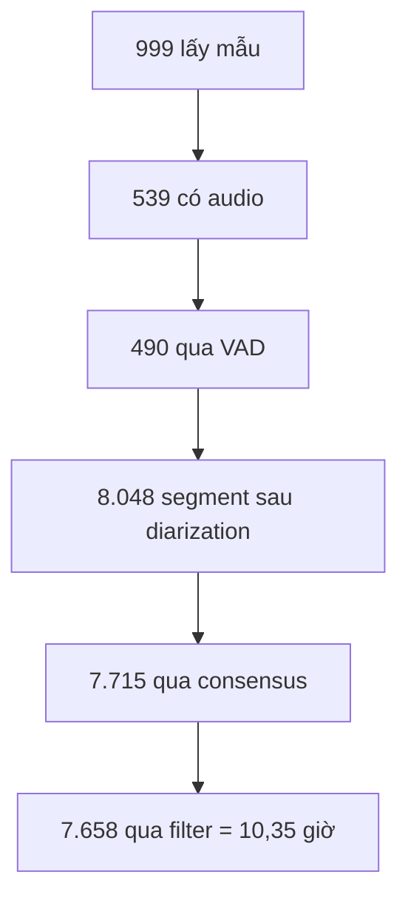

# Quy trình xử lý dữ liệu: từ audio thô (crawl) → dữ liệu sạch cho ASR

> Tài liệu này mô tả **toàn bộ quy trình xử lý dữ liệu**: biến audio/video thô thu thập từ mạng xã hội thành các **segment ngắn, sạch, có transcript + timestamp + nhãn (speaker, gender, vùng miền…)**, sẵn sàng làm dữ liệu training ASR.
>
> Số liệu thống kê chụp ngày **2026-06-11**.

---

## 0. Bản đồ nhanh (đọc cái này trước)



Toàn bộ pipeline = **3 khối**: **A. Ingest** (thu thập) → **B. Xử lý** (tách + nhận dạng + gán nhãn) → **C. Lọc** (chọn dữ liệu sạch). Mỗi bước nhỏ là một **stage** cắm-rút được (đổi công cụ qua config).

| | Mô tả |
|---|---|
| **Đầu vào** | audio/video thô + phụ đề + metadata (TikTok/YouTube/Facebook/Instagram/Threads) |
| **Đầu ra** | segment 1–30s, mỗi cái có `audio_filepath, duration, text, timestamps, speaker_id, num_speakers, gender, region, age…` |

---

## 1. Nguồn dữ liệu raw (crawl) & thống kê đầu vào

Dữ liệu đến từ hệ thống crawl độc lập **`social-video-crawl`**: crawl bằng `yt-dlp`, lưu **metadata trong PostgreSQL** + **media (WAV 44.1kHz, MP4, phụ đề VTT) trong MinIO**, gắn **tag chủ đề** (taxonomy STT/TTS).



**Tổng (2026-06-11):** 347.734 item · **185.847 đã hoàn tất** · **~5.807 giờ** · 73 tag.

| Platform | Completed | Có audio | Có subtitle |
|---|---:|---:|---:|
| **TikTok** | 160.235 | 121.121 | 109.589 |
| **YouTube** | 22.559 | 18.681 | 7.197 |
| Facebook | 1.201 | 73 | 0 |
| Threads / Instagram | ~1.8k | ~0 | 0 |

**Tag = nhãn yếu sẵn có** (quan trọng): tên tag mã hoá luôn vùng miền/độ tuổi/cảm xúc của dữ liệu.

| Tag (ví dụ) | Item | Giờ | Suy ra nhãn |
|---|---:|---:|---|
| STT Miền Bắc | 91.537 | 2.003 | region=northern |
| STT Miền Nam | 28.870 | 863 | region=southern |
| STT Thanh niên | 24.345 | 376 | age=teen |
| TTS Giọng hay | 84.881 | 2.553 | data_type=tts |
| STT Say rượu không tỉnh táo | 89 | 1.3 | voice_state=intoxicated |

---

## 2. Khối A — Ingest (lấy mẫu + tải về)

CLI: `scripts/ingest_crawl.py`. Code: `src/multitalker_asr/data/crawl/`.



- **Lấy mẫu phân tầng**: đảm bảo mỗi ô (platform × tag) đều có đại diện, không tải toàn bộ.
- **Tải qua MinIO SDK** (URL presigned của vStorage lỗi 403 với key có dấu cách).
- Lưu vào `{platform}/{primary_tag}/{video_id}/` + `meta.json` (truy vết).
- Kết quả: **`seed.jsonl`** — mỗi dòng = 1 clip nguồn + nhãn yếu.

```bash
python scripts/ingest_crawl.py --sample 1000 \
    --platforms tiktok,youtube,facebook --tag-family stt,tts \
    --vietnamese --seed 123 --out-root /home/samdv/DATA/crawl-2026
```

---

## 3. Khối B — Pipeline xử lý (raw → có nhãn + transcript)

Chuỗi stage (cấu hình trong `configs/pipeline_crawl_invenv.yaml`):



| Stage | Làm gì | Công cụ |
|---|---|---|
| `extract_audio` | Đưa mọi media về **WAV 16kHz mono** | ffmpeg |
| `vad` | Bỏ clip gần như im lặng | silero · pyannote_seg · ten · **consensus** (mục 3.0) |
| `vad_diarize` | **Tách đoạn theo người nói**; gắn cờ overlap | pyannote / Sortformer / VAD (mục 3.1) |
| `speaker_verify` | **Kiểm tra & sửa nhãn người nói** | model speaker verification (mục 3.2) |
| `transcribe` | Nhận dạng → text + dấu câu + timestamps | đa provider (mục 3.3) |
| `gender_classify` | Phân loại giới tính giọng | service ensemble (wav2vec2+ECAPA) |
| `consensus` / `filter` | Lọc chất lượng | mục 4 |

### 3.0. VAD — 1 backend hoặc đồng thuận nhiều provider

`config.vad.backend`: chọn 1 engine (`silero`, `pyannote_seg` = pyannote/segmentation-3.0, `ten`, `fsmn`) **hoặc** `consensus` để hợp nhất nhiều engine. Backend dùng chung cho cả `vad` (prefilter im lặng) và phần trim/`vad_sv` của `vad_diarize`.

**`consensus`** chạy nhiều provider song song, raster hoá các vùng speech lên lưới frame chung rồi vote theo frame — một frame chỉ được coi là speech khi đủ provider đồng ý. Cấu hình qua `vad.backend_kwargs`:

```yaml
vad:
  backend: consensus
  backend_kwargs:
    strategy: majority        # majority (>=ceil(N/2)) | intersection (==N) | union (>=1)
    frame_hop_s: 0.02
    providers: [{name: silero}, {name: pyannote_seg}, {name: ten}]
```

- `majority` (khuyến nghị): chịu được lỗi của 1 provider, cân bằng precision/recall. `intersection` = chặt nhất (ít false-speech), `union` = rộng nhất. `min_votes` override ngưỡng.
- Provider thiếu thư viện (chưa cài `ten-vad`/`pyannote.audio`) bị **bỏ qua kèm cảnh báo**; consensus chạy trên các provider còn lại và log số provider thực tế. `pyannote_seg` gated → cần `HF_TOKEN`.
- So sánh các provider: `python scripts/benchmark_vad_providers.py --audio <wav>` (in speech_ratio, RTF, số segment, IoU từng cặp, độ lệch so với majority). Cài đủ provider: `uv sync --extra vad`.

### 3.1. Tách người nói (diarization) — 3 backend chọn được

`config.diarize.backend`:



- **sortformer** (khuyến nghị): dùng `models/diar_streaming_sortformer_4spk-v2.1.nemo` — tách tới 4 người, **phát hiện overlap tự nhiên**, không cần token HF. (Đã verify: clip 17s → 4 người + overlap.)
- **pyannote**: model gated, cần HF token.
- **vad_sv**: chỉ silero VAD tách đoạn; việc gán nhãn người nói để `speaker_verify` làm.

**Overlap (nhiều người nói cùng lúc):** đoạn giao thời gian với người nói khác ≥ `overlap_min_s` → gắn cờ `is_overlap=true`, **giữ lại** (không bỏ), ghi `num_speakers`.

### 3.2. Kiểm tra & sửa nhãn người nói (speaker_verify)

Diarization có thể gán **sai nhãn** (gộp 2 người thành 1, hoặc tách nhầm). `speaker_verify` dùng **model speaker verification** (ECAPA-TDNN, qua service `/embed`) để soát lại:



- Trích **embedding giọng** từng segment → **gom cụm** (agglomerative cosine) → **sửa `speaker_id`** theo cụm giọng thật, đặt `num_speakers`.
- Segment **rõ ràng lệch cụm & không overlap** → loại; **overlap** → giữ.
- Ghi `extra.speaker_consistency` (độ nhất quán giọng).
- **Lưu ý ngưỡng**: ngưỡng cosine mặc định của service (0.725) **tách quá tay** với clip crawl ngắn/nhiễu → dùng **`cluster_threshold=0.45`** (đã hiệu chỉnh). Cần tinh chỉnh theo dataset.

> Có thể đảo: dùng `vad_sv` (VAD tách đoạn) rồi để `speaker_verify` gán nhãn = một diarizer "VAD + speaker model" thay cho pyannote.

### 3.3. Nhận dạng (transcription) — đa provider (gồm Google STT, VietASR)

`transcribe` (1 model) hoặc `multi_transcribe` (ensemble nhiều provider → chọn kết quả tốt nhất). Timestamps lấy luôn từ output ASR.



| Provider (`ASR_REGISTRY`) | Loại | Ghi chú |
|---|---|---|
| `funasr` / `funasr_mlt` | Local | Fun-ASR-MLT: dấu câu tốt, có word timestamps |
| `qwen3_vllm` | HTTP | Qwen3-ASR qua vLLM |
| **`google_speech`** | Cloud | **Google Speech-to-Text V2** (`chirp_3`, vi-VN, auto punctuation, word timestamps). Bật: `uv add google-cloud-speech` + GCP credentials. |
| `vietasr` | On-device | SDK `viet-asr`, model ONNX 66MB nhúng trong wheel, offline CPU; text thường không dấu câu |
| `nemotron` | Local (GPU) | `nvidia/nemotron-3.5-asr-streaming-0.6b` — NeMo streaming, 19 ngôn ngữ. Text-only (không word timings) → cần `align_backend` để vào ROVER. Bật: `uv sync --extra asr` (kéo `librosa`). |

---

## 4. Khối C — Lọc dữ liệu sạch

**`consensus`** — cổng đồng thuận đa tín hiệu (giữ segment chỉ khi các tín hiệu khớp nhau):



**`filter`** — lọc thêm: độ dài text, tỉ lệ ký tự/giây, độ tin nhãn.

**Phễu số liệu thật (mẫu 1000):**



---

## 5. (Tuỳ chọn) Xử lý lại đoạn overlap bằng model multitalker

Thay vì bỏ đoạn overlap, stage `multitalker_reprocess` (mặc định **off**) re-transcribe bằng `models/multitalker-vietnamese.nemo` → **transcript riêng cho từng người nói** trong đoạn chồng giọng. Cần GPU + model 2.4G; bật qua `overlap_reprocess.enabled=true`.

---

## 6. Định dạng đầu ra

```
crawl-2026/
├── {platform}/{primary_tag}/{video_id}/   # media nguồn + meta.json
├── segments/                              # WAV từng segment
├── {platform}/manifest.jsonl              # manifest theo platform
├── manifest_all.jsonl                     # gộp tất cả segment (training)
├── dataset_metadata.jsonl                 # ledger: 1 dòng / clip nguồn
└── dataset_summary.json
```

**Cam kết chất lượng** mỗi segment: có **2 bản text** (`text` đã ITN+PnC, `text_raw` dạng nói chưa chuẩn hoá); **đủ 6 trục nhãn** (language, emotion, gender, age, region, voice_state — tag/model nếu có, ngược lại default + confidence 0 để training mask được); **`segment_type`** = `single` hoặc `overlap`; thông tin người nói (`speaker_id`, `num_speakers`).

```json
{
  "audio_filepath": ".../segments/abc_SPK_0_3.20_7.10.wav",
  "duration": 3.9,
  "text": "Xin chào quý vị và các bạn.",      // đã ITN + PnC
  "text_raw": "xin chào quý vị và các bạn",   // chưa chuẩn hoá
  "text_itn": "Xin chào quý vị và các bạn.", "textnorm": "withitn",
  "segment_type": "single", "speaker_id": "SPK_0", "num_speakers": 1,
  "language": "vi", "emotion": "neutral", "gender": "female",
  "age": "teen", "region": "northern", "voice_state": "sober",
  "attribute_confidence": {"language": 0.99, "gender": 0.99, "region": 0.95,
                            "age": 0.95, "emotion": 0.0, "voice_state": 0.0},
  "extra": {"platform": "tiktok", "is_overlap": false, "speaker_consistency": 0.71,
            "subtitle_similarity": 0.91}
}
```

Đoạn **overlap** (nhiều người nói cùng lúc): `segment_type="overlap"`, `num_speakers≥2`, kèm transcript từng người trong `extra.multitalker_segments=[{speaker,text,start,end}]` (do `multitalker_reprocess`).

Báo cáo đa dạng/đủ-tag: `scripts/dataset_report.py --manifest manifest_all.jsonl` (in phân bố 6 trục + single/overlap + cảnh báo mất cân bằng).

- `dataset_metadata.jsonl`: mỗi clip nguồn → tags, weak_labels, n_kept_segments, mean_consensus_score… (truy vết/debug).

---

## 7. Ví dụ chạy thật

Dataset `/home/samdv/DATA/crawl-2026` (mẫu 1.000):

| Chỉ số | Giá trị |
|---|---|
| Clip nguồn có audio | 539 (345 ra segment) |
| **Tổng segment / giờ** | **7.658 / 10,35 giờ** |
| Độ dài segment | TB 4,9s · trung vị 3,0s |
| Clip nhiều người nói | 100 / 345 |
| Đối chiếu phụ đề | TB 0,74 |
| Phân bố | youtube 4.999 · tiktok 2.449 · fb 210 · region B/T/N · gender ♂4.844/♀2.814 |

- **Gender** re-tag bằng model ensemble đổi **18,4%** nhãn so với heuristic F0.
- **Speaker_verify** (threshold 0,45): video pyannote gán 1 người → tách đúng thành 2 người (SPK_0/SPK_1).

---

## 8. Cách chạy (3 bước)

```bash
# 1) Ingest
python scripts/ingest_crawl.py --sample 1000 --platforms tiktok,youtube,facebook \
    --tag-family stt,tts --vietnamese --seed 123 --out-root /home/samdv/DATA/crawl-2026

# 2) Pipeline
python scripts/run_pipeline.py --config configs/pipeline_crawl_invenv.yaml \
    --output_dir /home/samdv/DATA/crawl-2026

# 3) (Tuỳ chọn) QC lại nhãn người nói / gender trên dataset có sẵn
python scripts/verify_speakers.py --manifest .../manifest_all.jsonl --service-url http://localhost:2010/embed
python scripts/retag_gender.py     --manifest .../manifest_all.jsonl
```

---

## 9. Backend & cấu hình (cắm-rút)

| Khâu | Lựa chọn | Config |
|---|---|---|
| VAD | silero · fsmn · ten · pyannote_seg | `vad.backend` |
| Diarizer | **sortformer** · pyannote · vad_sv | `diarize.backend` |
| Speaker verify | service ECAPA `/embed` | `speaker_verify.*` |
| ASR | funasr_mlt · qwen3_vllm · **google_speech** · vietasr · nemotron | `multi_transcribe.backends` |
| Gender | service ensemble · f0_heuristic | `gender.url` |

Knob hay dùng: `vad.min_duration/max_duration`, `diarize.overlap_min_s`, `speaker_verify.cluster_threshold` (0.45), `consensus.*`, `manifest.shard_by=platform`.

---

## 10. Services & môi trường

| Service | Cổng | Dùng cho | Lưu ý |
|---|---|---|---|
| social-video-crawl API | 8010 | Ingest | bearer token |
| gender-classification-service | 8000 | gender | GPU (model nhỏ) |
| speaker-recognition (`/embed`) | **2010** | speaker_verify, vad_sv | GPU bắt buộc (code hardcode cuda); model HF private cần token; field upload `voice_data` |
| qwen3_vllm ASR | 8101 | transcription | tuỳ chọn |

**Model trên đĩa** (`models/`): `diar_streaming_sortformer_4spk-v2.1.nemo` (diarization), `multitalker-vietnamese.nemo` (re-transcribe overlap).

**Phụ thuộc**: funasr + Fun-ASR-MLT (ModelScope), pyannote.audio (HF token), `viet-asr`, `scikit-learn` (clustering), `google-cloud-speech` (tuỳ chọn). Ghim `torchaudio==2.10.0+cu128`.

---

> 📄 Tham chiếu nhanh tất cả model backend (key registry, model, ghi chú): [model-backends.md](model-backends.md)

## 11. Kiến trúc service hoá (docker-compose, REST, URL-only)

Để tránh xung đột env (qwen-asr transformers 4.57 vs NeMo 5.3; nemotron cần NeMo overlay; ten-vad cần libc++; pyannote gated), **mỗi nhóm model chạy trong container riêng**, pipeline chỉ gọi qua **REST** và config **chỉ truyền URL**. Image `pipeline` không có torch/nemo/funasr (≈770MB).

**Một contract REST cho mỗi nhóm → một client URL-only** (đặt `backend: service` + `backend_kwargs.base_url`):

| Nhóm | Endpoint | Server (in-repo) | Client (registry key) |
|---|---|---|---|
| VAD | `POST /vad` | `scripts/serve_vad.py` | `service` ([vad_backends/service.py](../src/multitalker_asr/data/pipeline/vad_backends/service.py)) |
| ASR | `POST /asr` | `scripts/serve_asr.py` (funasr/nemotron/vietasr) | `service` / `funasr_mlt` |
| ASR vLLM | `POST /v1/chat/completions` | `qwen-asr-serve` | `qwen3_vllm` |
| Align | `POST /align` | `scripts/serve_align.py` (mms_fa/nemo_nfa), `serve_qwen3_aligner.py` | `service` / `qwen3_service` |
| Speaker | `POST /embed` | repo ngoài (build context) | `SpeakerEmbedder` (`speaker_verify.url`) |
| Gender | `POST /predict` | repo ngoài (build context) | stage `gender_classify` (`gender.url`) |

Khung serving dùng chung: [serving/app_factory.py](../src/multitalker_asr/serving/app_factory.py) (`create_audio_service` — temp WAV + `/health` + đo thời gian). Mỗi `serve_*.py` chỉ định backend + gọi factory.

**Chạy:**
```bash
cp .env.example .env            # set HF_TOKEN, GPU_DEVICE, SPEAKER_REPO/GENDER_REPO, DATA_DIR
docker compose up vad asr-funasr align-mms speaker-embed gender   # core
docker compose --profile full up        # + nemotron / vietasr / qwen3 / qwen3-aligner
docker compose run --rm pipeline        # orchestrator (config: pipeline_crawl_services.yaml)
```

**Diarization trong pipeline-nhẹ**: dùng mode `vad_sv` (VAD service cắt đoạn + `/embed` gom cụm), không cần container diarizer NeMo. Cần sortformer/pyannote thì chạy như một service tuỳ chọn riêng.

Config tham chiếu: [configs/pipeline_crawl_services.yaml](../configs/pipeline_crawl_services.yaml) (URL lấy từ env `VAD_URL`/`ASR_URL`/`ALIGN_URL`/`EMBED_URL`/`GENDER_URL`).
